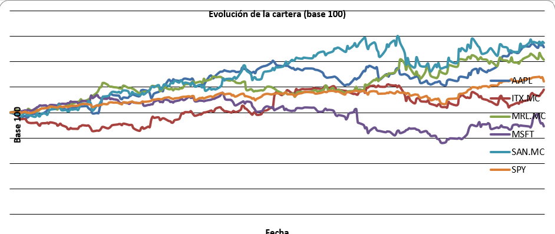
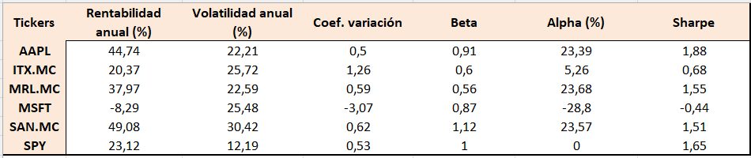
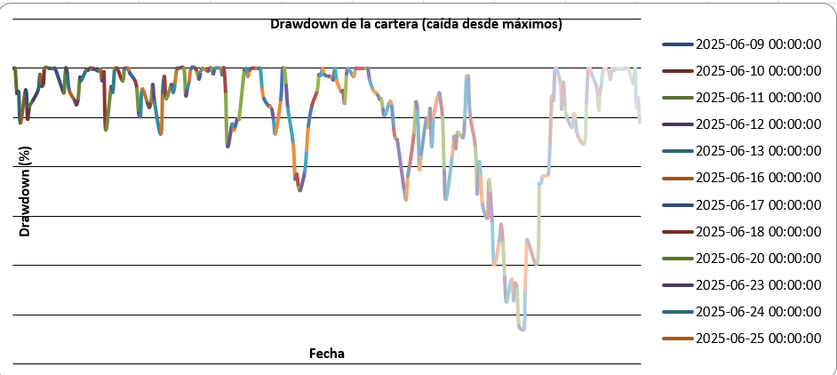

#  Analizador de Cartera de Inversión

Herramienta en Python que analiza una cartera de acciones combinando gestión de riesgo, análisis técnico y valoración fundamental. La desarrollé como proyecto personal mientras cursaba el grado de Administración y Dirección de Empresas, utilizando lo aprendido en la asignatura *Bolsa y Mercados de Capitales* de la Universidad Autónoma de Madrid más los conocimientos personales que he ido adquiriendo a lo largo de los años (pues las finanzas siempre me han llamado la atención tanto para emplear sus fundamentos a nivel personal como para ejercer en este ámbito a nivel profesional).

El programa descarga precios reales de Yahoo Finance, calcula métricas de riesgo y rentabilidad, aplica indicadores técnicos, valora cada acción por múltiplos y por descuento de flujos (DCF), y exporta todo a un Excel con gráficos.

---

##  Qué hace

- **Rentabilidad y riesgo de cada activo**: rentabilidad anualizada, volatilidad y coeficiente de variación.
- **Modelo CAPM frente al S&P 500**: cálculo de beta y alpha de cada acción.
- **Análisis de la cartera real** (a partir de un CSV con tus posiciones): pesos, plusvalías, rentabilidad, volatilidad y ratio de Sharpe usando la matriz de covarianzas (efecto diversificación).
- **Valoración por múltiplos** (PER, EV/EBITDA, P/B) comparando cada acción con la media de su sector según datos de Damodaran (NYU Stern), etiquetando cada valor como caro o barato.
- **Valoración por DCF simplificado**: proyección de flujos de caja libres, descuento a WACC, valor terminal de Gordon y valor intrínseco por acción.
- **Análisis técnico de un activo a elegir**: medias móviles (SMA 20/50), MACD y RSI(14).
- **Backtesting de estrategias** (cruce de medias y medias + RSI) frente a comprar y mantener.
- **Métricas de riesgo**: VaR al 95% (histórico y paramétrico) y máximo drawdown de la cartera.
- **Exportación a Excel** con 15 hojas y gráficos nativos.

---

## 📸 Capturas








---

##  Conceptos financieros aplicados

| Concepto | Qué se calcula en el código |
|---|---|---|
| Diversificación y CAPM |  Beta, alpha, volatilidad de cartera por matriz de covarianzas |
| Ratio de Sharpe | Rentabilidad ajustada al riesgo |
| VaR y máximo drawdown | Pérdida máxima esperada (95%) y peor caída desde máximos |
| Análisis técnico | SMA, MACD, RSI y backtesting de estrategias |
| Valoración por múltiplos | PER, EV/EBITDA y P/B frente al sector (Damodaran) |
| Valoración por DCF | FCF, WACC, valor terminal y valor intrínseco por acción |

---

## Cómo ejecutarlo

```bash
# 1. Clonar el repositorio
git clone https://github.com/TU-USUARIO/analizador-cartera.git
cd analizador-cartera

# 2. Crear y activar un entorno virtual (Windows)
python -m venv venv
venv\Scripts\activate

# 3. Instalar las librerías necesarias
pip install -r requirements.txt

# 4. Ejecutar
python analizador.py
```

Al ejecutarlo te pedirá qué activo analizar a fondo (medias, MACD, RSI, backtesting y DCF). Al terminar genera el archivo `analisis_cartera.xlsx` con todos los resultados.

Para usar tu propia cartera, edita el archivo `cartera.csv` (columnas: `ticker,cantidad,precio_compra`). Los tickers españoles llevan el sufijo `.MC` (por ejemplo `SAN.MC`). Usa el punto como separador decimal.

---

##  Qué genera

Un Excel (`analisis_cartera.xlsx`) con hojas para precios, datos normalizados, resumen de métricas, indicadores técnicos, backtesting, cartera real, valoración por múltiplos, DCF, riesgo (VaR y drawdown) y varios gráficos.

---

## Limitaciones conocidas

Este proyecto es una herramienta de aprendizaje, no de uso profesional. Conviene tener en cuenta que:

- Los datos provienen de **Yahoo Finance gratuito**, que no tiene la calidad ni la fiabilidad de un proveedor institucional (Bloomberg, Refinitiv).
- La cartera mezcla activos en USD y EUR sin conversión de divisa, por lo que los valores agregados son aproximados.
- Los múltiplos sectoriales de Damodaran son del mercado estadounidense, usados como referencia aproximada para valores europeos (que suelen cotizar más bajos).
- El backtest cubre solo 1 año y no incluye comisiones ni deslizamiento , por lo que sus resultados son optimistas.
- El DCF es muy sensible a los supuestos (crecimiento, WACC) y no aplica a bancos ni SOCIMIs (en esos casos devuelve "no disponible", que es el comportamiento correcto).
- El VaR paramétrico asume normalidad de los retornos, por lo que tiende a infravalorar los eventos extremos.


---

##  Autora

**Stephanie Blanco Jones** — Estudiante de 4º de ADE, Universidad Autónoma de Madrid.

- LinkedIn: [https://www.linkedin.com/in/stephanie-blanco-jones-1555a6244/]
- GitHub: [@steblanco029](https://github.com/steblanco029)
